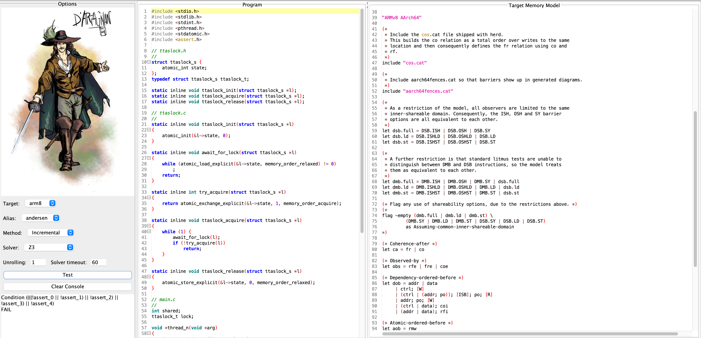

# Dat3M: Memory Model Aware Verification

<p align="center"> 

</p>

**Dartagnan** is a tool to check state reachability under weak memory models.

Requirements
======
* [Maven](https://maven.apache.org/) (if you want to build the tools. If not see the [release](https://github.com/hernanponcedeleon/Dat3M/releases) section)
* [Java 8](https://openjdk.java.net/projects/jdk/16/) or above (if you want to compile from source)
* [SMACK 2.5.0](https://github.com/smackers/smack) or above (only to verify C programs)

Installation
======

**Docker**

The docker contains everything pre-installed to run the tool.

1. Build the container:
```
docker build . -t dartagnan
```

2. Run the container:
```
docker run -w /home/Dat3M -v /sys/fs/cgroup:/sys/fs/cgroup:rw -it dartagnan /bin/bash
```

**From Sources**

Download the z3 dependency
```
mvn install:install-file -Dfile=lib/z3-4.8.10.jar -DgroupId=com.microsoft -DartifactId="z3" -Dversion=4.8.10 -Dpackaging=jar
```
Set Dat3M's home, the path and shared libraries variables (replace the latter by DYLD_LIBRARY_PATH in **MacOS**)
```
export DAT3M_HOME=<Dat3M's root>
export PATH=$DAT3M_HOME/:$PATH
export LD_LIBRARY_PATH=$DAT3M_HOME/lib/:$LD_LIBRARY_PATH
```

To build the tool run
```
mvn clean install -DskipTests
```

**Unit Tests**

We provide a set of unit tests that can be run by
```
mvn test
```
**Note:** there are almost 40K tests, running them can take several hs.

Usage
======
Dat3M comes with a user interface (not available from the docker container) where it is easy to import, export and modify both the program and the memory model and select the options for the verification engine (see below).
You can start the user interface by running
```
java -jar ui/target/ui-2.0.7-jar-with-dependencies.jar
```
<p align="center"> 

</p>

Dartagnan supports programs written in the `.litmus` or `.bpl` (Boogie) formats.

If SMACK was correctly installed, C programs can be converted to Boogie using the following command:
```
smack -t -bpl <new Boogie file> <C file> [--integer-encoding bit-vector] --no-memory-splitting --clang-options="-DCUSTOM_VERIFIER_ASSERT -I\$DAT3M_HOME/include/"
```

You can also run Dartagnan from the console:

```
java -jar dartagnan/target/dartagnan-2.0.7-jar-with-dependencies.jar -cat <CAT file> [-t <target>] -i <program file> [options]
```
The `-cat` option specifies the path to the CAT file.

For programs written in the `.bpl`, `\<target>` specify the architectures to which the program will be compiled. It must be one of the following: 
- none
- tso
- power
- arm
- arm8

Program written in `.litmus` format do not require such option.

Other optional arguments include:
- `-a, --alias {none, andersen, cfs}`: specifies the alias-analysis used. Option andersen (the default one) uses a control-flow-insensitive method. Option cfs uses a control-flow-sensitive method. Option none performs no alias analysis.
- `-unroll`: unrolling bound for the BMC.

Dartagnan supports input non-determinism, assumptions and assertions using the [SVCOMP](https://sv-comp.sosy-lab.org/2020/index.php) commands `__VERIFIER_nondet_X`, `__VERIFIER_assume` and `__VERIFIER_assert`.

**SV-COMP Experiments**

The docker container includes the [benchexec](https://github.com/sosy-lab/benchexec) framework to run all [SV-COMP](https://sv-comp.sosy-lab.org/) experiments, just run (this can take a couple of hs)
```
benchexec dartagnan.xml --no-container
```
The `dartagnan.xml` file instructs benchexec to use 4 CPUs, so either be sure your docker configuration has access to 4 CPUs or change the entry `cpuCores="4"` to match you CPUs limit.

Authors and Contact
======
**Maintainer:**

* [Hernán Ponce de León](mailto:hernan.ponce@unibw.de)

**Developers:**

* [Thomas Haas](mailto:t.haas@tu-braunschweig.de)

**Former Developers:**

* Florian Furbach
* Natalia Gavrilenko

Please feel free to contact us in case of questions or to send feedback.

References
======
[1] Hernán Ponce de León, Florian Furbach, Keijo Heljanko, Roland Meyer: **Portability Analysis for Weak Memory Models. PORTHOS: One Tool for all Models**. SAS 2017.

[2] Hernán Ponce de León, Florian Furbach, Keijo Heljanko, Roland Meyer: **BMC with Memory Models as Modules**. FMCAD 2018.

[3] Natalia Gavrilenko, Hernán Ponce de León, Florian Furbach, Keijo Heljanko, Roland Meyer: **BMC for Weak Memory Models: Relation Analysis for Compact SMT Encodings**. CAV 2019.

[4] Hernán Ponce de León, Florian Furbach, Keijo Heljanko, Roland Meyer: **Dartagnan: Bounded Model Checking for Weak Memory Models (Competition Contribution)**. TACAS 2020.

[5] Hernán Ponce de León, Thomas Haas, Roland Meyer: **Dartagnan: Leveraging Compiler Optimizations and the Price of Precision (Competition Contribution)**. TACAS 2021.
